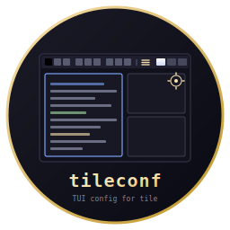

# tileconf - TUI Config for tile



    

TUI configuration tool for the [tile](https://github.com/isene/tile) window manager
(plus its [strip](https://github.com/isene/tile) status bar), built on
[crust](https://github.com/isene/crust). Live preview shows what the bar
will look like as you tweak colours.

<br clear="left"/>

## Features

- **Bar**: height, padding, strip-height reservation, inner gap, bar background
- **Workspaces**: default active/populated colours, dim factor, plus per-workspace fixed-colour overrides for WS 1..10
- **Tabs**: default tab colour, dim factor, full Mod4+c rotation palette
- **Border**: width, focused colour, unfocused colour
- **Layout**: master-pane width ratio (10..90 %)
- Read-only views for `Autostart`, `Bindings` and `Pins` so you can see
  what your `~/.tilerc` declares without leaving the editor (those
  three keep their canonical place in the file)
- Live colour swatches for every hex value
- After save, optionally:
  - `pkill -USR1 -x tile` → tile re-reads `~/.tilerc` and re-paints
  - `pkill -x strip && setsid strip` → restart the status bar in place
- **Atomic save**: writes `~/.tilerc.tmp`, renames the previous file
  to `~/.tilerc.bak`, then promotes the new file into place. Worst
  case the user can `mv ~/.tilerc.bak ~/.tilerc`

## Controls

| Key | Action |
|-----|--------|
| j / k       | Move within the current category |
| J / K       | Switch categories |
| h / l       | Cycle / step through values (numeric / palette) |
| Enter       | Edit the current value (free-text input) |
| W / s       | Save to `~/.tilerc` (then asks: y=tile+strip / t=tile only / n=skip) |
| q / ESC     | Quit (prompts to save when modified) |

## Build

```bash
cargo build --release
```

The binary lands at `target/release/tileconf`. Symlink or copy it
into your `PATH`:

```bash
ln -sf $PWD/target/release/tileconf ~/bin/tileconf
```

## Recovering from a bad save

If `~/.tilerc` ever ends up wrong, the previous good copy is one
rename away:

```bash
mv ~/.tilerc.bak ~/.tilerc
```

(tileconf only writes `.bak` after a successful `.tmp` write, so this
file is always either the previous saved state or absent.)

## Part of the [CHasm](https://github.com/isene/chasm) Suite

| Tool | Purpose |
|------|---------|
| [bare](https://github.com/isene/bare)         | Shell (assembly) |
| [glass](https://github.com/isene/glass)       | Terminal emulator (assembly) |
| [tile](https://github.com/isene/tile)         | Window manager + strip status bar (assembly) |
| [show](https://github.com/isene/show)         | File viewer (assembly) |
| [chasm-bits](https://github.com/isene/chasm-bits) | Asmite helpers fed into strip (assembly) |
| [bareconf](https://github.com/isene/bareconf) | Config TUI for bare (Rust) |
| [glassconf](https://github.com/isene/glassconf) | Config TUI for glass (Rust) |
| **tileconf**                                  | **Config TUI for tile (Rust)** |
| [stripconf](https://github.com/isene/stripconf) | Config TUI for strip (Rust) |

## License

[Unlicense](https://unlicense.org/) (public domain).
